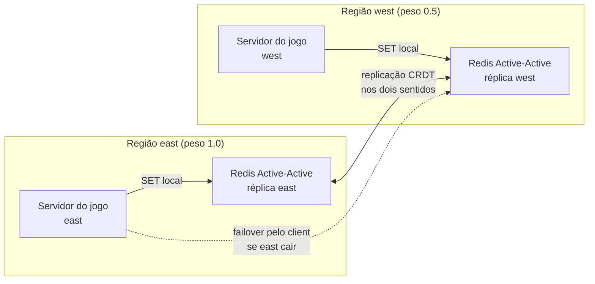

# Active-Active e failover geográfico

<p class="lesson-meta">Lição 301-05 · Lab · 12 min</p>

Usuários em São Paulo e Lisboa, nenhum aceitando 200 ms por operação. Active-Active resolve no servidor: réplicas em cada região, todas aceitando leitura e escrita locais, sincronizadas por CRDTs que reconciliam escritas concorrentes sem coordenador central. Na aplicação sobra uma pergunta: se a réplica da minha região cair, quem escolhe a outra? O Jedis oferece `MultiDbClient` como recurso **experimental**; no Lettuce 7.7 ele está em preview. Nesta lição, dois Redis locais independentes demonstram o failover do client, sem replicação CRDT.



## O que o lab faz

- Subir dois "datacenters" locais, `east` (6391) e `west` (6392), com `docker compose --profile failover up -d`
- Configurar pesos 1.0 e 0.5, health check por `PING`, circuit breaker, retry e failback
- Rodar um heartbeat (`SET quest:heartbeat` a cada 500 ms por 20 s) que imprime qual região atendeu
- Derrubar o east em outro terminal, ver a troca, subir de novo e ver o failback
- Repetir com o `MultiDbClient` do Lettuce (preview) e ler os eventos de troca no event bus

## Faça agora

```bash
docker compose --profile failover up -d
./quest run 301-05 jedis
./quest run 301-05 lettuce    # opcional: mesmo lab, outro client
./quest verify 301-05
```

Em outro terminal, enquanto o heartbeat roda:

```bash
docker stop quest-redis-east      # a troca para west aparece em 1 a 2 s
docker start quest-redis-east     # o failback para east vem depois da carência de 2 s
```

Para usar dois bancos seus (duas réplicas Active-Active, por exemplo), defina `QUEST_EAST_URL` e `QUEST_WEST_URL`. Se os bancos não estiverem disponíveis, o lab fica pendente. O `verify` separa heartbeat, failover e failback: uma escrita bem-sucedida sozinha não comprova troca de região.

Comece com os dois bancos ativos. Depois da primeira batida no east, pare o east; quando houver escrita confirmada no west, restaure o east e espere uma nova escrita nele. Só essa sequência comprova failover e failback. Para ter mais tempo, configure `QUEST_FAILOVER_SECONDS=60` no `.env` (intervalo permitido: 5 a 300 segundos).

## O código

=== "Jedis"

    ```java
    HostAndPort east = new HostAndPort("localhost", 6391);
    HostAndPort west = new HostAndPort("localhost", 6392);
    JedisClientConfig config = DefaultJedisClientConfig.builder()
            .connectionTimeoutMillis(1000).socketTimeoutMillis(1000).build();

    HealthCheckStrategy.Config health = new HealthCheckStrategy.Config(1000, 500, 1, 100, ProbingPolicy.BuiltIn.ALL_SUCCESS);
    MultiDbConfig.StrategySupplier ping = (hostAndPort, clientConfig) -> new PingStrategy(hostAndPort, clientConfig, health);

    MultiDbConfig multiConfig = MultiDbConfig.builder()
            .database(MultiDbConfig.DatabaseConfig.builder(east, config).weight(1.0f).healthCheckStrategySupplier(ping).build())
            .database(MultiDbConfig.DatabaseConfig.builder(west, config).weight(0.5f).healthCheckStrategySupplier(ping).build())
            .failureDetector(MultiDbConfig.CircuitBreakerConfig.builder()
                    .slidingWindowSize(2).minNumOfFailures(2).failureRateThreshold(50.0f).build())
            .commandRetry(MultiDbConfig.RetryConfig.builder()
                    .maxAttempts(2).waitDuration(100).exponentialBackoffMultiplier(2).build())
            .retryOnFailover(true).fastFailover(true)
            .failbackSupported(true).failbackCheckInterval(1000).gracePeriod(2000)
            .initializationPolicy(InitializationPolicy.BuiltIn.ONE_AVAILABLE)
            .build();

    try (MultiDbClient client = MultiDbClient.builder()
            .multiDbConfig(multiConfig)
            .databaseSwitchListener(event -> System.out.println(
                    "switched to " + event.getEndpoint() + " (" + event.getReason() + ")"))
            .build()) {
        for (int i = 1; i <= 40; i++) {
            client.set(heartbeat, Instant.now().toString());
            System.out.println("beat " + i + " -> " + client.getActiveDatabaseEndpoint());
            Thread.sleep(500);
        }
    }
    ```

=== "Lettuce"

    ```java
    RedisURI east = RedisURI.create("redis://localhost:6391");
    RedisURI west = RedisURI.create("redis://localhost:6392");

    HealthCheckStrategy.Config health = new HealthCheckStrategy.Config(1000, 500, 1, 100, ProbingPolicy.BuiltIn.ALL_SUCCESS);
    HealthCheckStrategySupplier ping = (uri, factory) -> new PingStrategy(factory, health);
    CircuitBreakerConfig breaker = CircuitBreakerConfig.builder()
            .metricsWindowSize(2).minimumNumberOfFailures(2).failureRateThreshold(50.0f).build();

    DatabaseConfig eastDb = DatabaseConfig.builder(east).weight(1.0f)
            .circuitBreakerConfig(breaker).healthCheckStrategySupplier(ping).build();
    DatabaseConfig westDb = DatabaseConfig.builder(west).weight(0.5f)
            .circuitBreakerConfig(breaker).healthCheckStrategySupplier(ping).build();
    MultiDbOptions options = MultiDbOptions.builder()
            .failbackSupported(true).failbackCheckInterval(Duration.ofSeconds(1))
            .gracePeriod(Duration.ofSeconds(2)).delayInBetweenFailoverAttempts(Duration.ofSeconds(1))
            .initializationPolicy(InitializationPolicy.BuiltIn.ONE_AVAILABLE)
            .build();

    MultiDbClient client = MultiDbClient.create(List.of(eastDb, westDb), options);
    client.getResources().eventBus().get()
            .filter(event -> event instanceof DatabaseSwitchEvent).cast(DatabaseSwitchEvent.class)
            .subscribe(event -> System.out.println(event.getFromDb() + " -> " + event.getToDb() + " (" + event.getReason() + ")"));

    try (StatefulRedisMultiDbConnection<String, String> connection = client.connect()) {
        for (int i = 1; i <= 40; i++) {
            connection.sync().set(heartbeat, Instant.now().toString());
            System.out.println("beat " + i + " -> " + connection.getCurrentEndpoint());
            Thread.sleep(500);
        }
    } finally {
        client.shutdown();
    }
    ```

## No Redis Insight

Adicione os dois bancos locais no Insight (`localhost:6391` e `localhost:6392`). Durante o heartbeat, `quest:heartbeat` avança no east; depois do `docker stop`, passa a avançar no west; depois do `docker start`, volta para o east. Como esses dois Redis locais não são Active-Active de verdade, o valor não se replica entre eles: essa é a lacuna que o Redis Cloud e o Redis Software fecham com CRDT. O banco do curso (`REDIS_URL`) só guarda o marcador `quest:progress:301-05` e o hash `quest:aa:clients`.

??? note "Por dentro"

    | Comando | O que faz |
    |---|---|
    | `PING` | O health check de cada região, a cada 1 s, com 500 ms de timeout; no lab, uma rodada falhada (1 probe) já marca a região como doente |
    | `SET quest:heartbeat <instante>` | A escrita da aplicação, sempre na região ativa; com `retryOnFailover`, a que falhar no meio da troca é refeita na nova região |
    | `HEALTH_CHECK` (evento) | Motivo da troca quando o health check declara a região doente antes do circuit breaker |
    | `CIRCUIT_BREAKER` (evento) | Motivo da troca quando as próprias operações falham acima do limite da janela |
    | `FAILBACK` (evento) | A região de maior peso voltou e cumpriu a carência: o client volta para ela |
    | `HSET quest:aa:clients <client> <instante>` | Registra qual client rodou, para o `verify` |

??? tip "Em produção"

    - Active-Active é recurso do Redis Software e do Redis Cloud (plano Pro): cada região lê e escreve na sua réplica com latência local, e a replicação CRDT reconcilia contadores, conjuntos e strings sem coordenador. A replicação entre regiões é assíncrona. O RPO e o tempo de recuperação dependem da rede, do atraso de replicação e da detecção de falha, além da configuração do client. Avalie essas condições para o seu workload.
    - `MultiDbClient` no Jedis é [experimental](https://redis.github.io/jedis/failover/) e usa resilience4j: no Maven, além de `resilience4j-circuitbreaker` e `resilience4j-retry`, inclua `resilience4j-all` (é de onde vem a classe `Decorators`). Os padrões do client são conservadores (janela do circuit breaker de 2 s com mínimo de 1000 falhas, carência de 60 s, failback a cada 2 min); o lab usa janelas curtas e um heartbeat de 20 s para permitir observar ida e volta. Em produção, aumente a carência para evitar flapping e avalie `LagAwareStrategy` (preview, Redis Software) para não voltar para uma réplica atrasada.
    - Lettuce 7.7 traz `io.lettuce.core.failover.MultiDbClient` em preview, com a mesma semântica (pesos, circuit breaker por banco, `PingStrategy`, failback e eventos no event bus). A alternativa sem código fica no servidor: o Redis Cloud redireciona dinamicamente o endpoint da réplica Active-Active que caiu para a réplica saudável, e a [lição 301-01](01-timeouts-pool-retry.md) configura a política de DNS antes da primeira conexão. SCH ([lição 301-04](04-smart-client-handoffs.md)) fica desligado quando o client está em modo failover.

??? tip "Desafio"

    Inverta os pesos (west 1.0, east 0.5) e confirme que o heartbeat começa no west. Depois derrube os dois datacenters durante o heartbeat: o Jedis lança `JedisTemporarilyNotAvailableException` a cada batida enquanto procura uma região saudável, e o Lettuce publica `AllDatabasesUnhealthyEvent` no event bus. Suba um deles e veja a recuperação.
