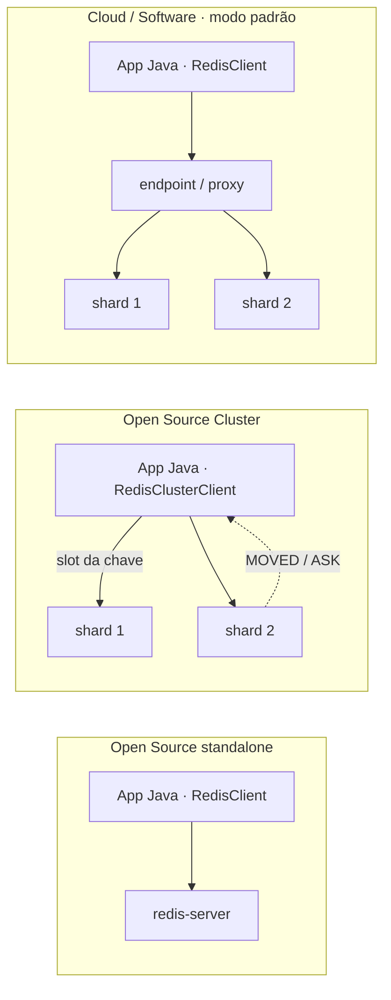

# Topologias: Redis Open Source, Cloud e Software

<p class="lesson-meta">Lição 100-01 · Lab · 8 min</p>

Antes de conectar, identifique **a topologia que o banco expõe**. Jedis e Lettuce são clients open source mantidos pela Redis e atendem Redis Open Source, Redis Cloud e Redis Software. A classe usada depende de quem deve rotear até os shards; o nome do host não configura isso automaticamente.

## Quem roteia o comando?

| Topologia | Caminho do comando | Jedis 8 | Lettuce 7 |
|---|---|---|---|
| Redis Open Source standalone | Aplicação → servidor | `redis.clients.jedis.RedisClient` | `io.lettuce.core.RedisClient` |
| Redis Open Source Cluster | Client calcula o slot, mantém topologia e trata `MOVED`/`ASK` | `redis.clients.jedis.RedisClusterClient` | `io.lettuce.core.cluster.RedisClusterClient` |
| Cloud / Software, acesso padrão | Aplicação → endpoint do banco → proxy → shard | `RedisClient` | `RedisClient` |
| Cloud / Software com OSS Cluster API habilitada | Client descobre topologia e acessa endpoints por shard através de proxies locais | `RedisClusterClient` | `RedisClusterClient` |



No Cluster OSS há **16.384 slots**. O client calcula o slot da chave, localiza o shard e atualiza seu mapa quando recebe redirecionamentos. Operações que exigem várias chaves no mesmo slot, como transações e scripts, precisam de planejamento de chaves; hash tags como `{cliente:123}` podem colocá-las juntas. Um pipeline é uma técnica de envio e não torna essas operações atômicas.

No modo padrão do Cloud/Software, o proxy cuida do roteamento. Com a **OSS Cluster API habilitada**, o client participa desse roteamento, mas os proxies locais continuam presentes: não é acesso direto aos processos Redis. A escolha dessa opção é configuração do banco. [Arquitetura oficial da OSS Cluster API](https://redis.io/docs/latest/operate/rs/clusters/optimize/oss-cluster-api/).

!!! note "Nomes atuais no Jedis 8"
    Este curso usa `RedisClient` e `RedisClusterClient`. `JedisPooled` foi removido no Jedis 8 e `JedisCluster` está depreciado. Exemplos antigos podem usar esses nomes; consulte o [guia de migração 7 → 8](https://redis.github.io/jedis/migration-guides/v7-to-v8/).

## Faça agora

```bash
./quest run 100-01 jedis
./quest run 100-01 lettuce    # comparação opcional
./quest verify 100-01
```

O mesmo diagnóstico está disponível em `./quest doctor`. Ele testa conexão, observa informações que o servidor permite consultar e mede dez `PING`s. A RTT é o tempo de ida e volta: um comando síncrono paga pelo menos esse custo de rede. O [pipeline](05-pipeline.md) reduz a quantidade de esperas sequenciais.

## Como ler o diagnóstico

| Resultado | O que você pode concluir |
|---|---|
| `PING: PONG` | Essa conexão autenticou e recebeu resposta |
| `redis_mode: standalone` | O endpoint se apresenta nesse modo; isso sozinho não distingue OSS de Cloud/Software |
| `CLUSTER INFO` disponível | Há informação de cluster acessível; confronte com a configuração do banco |
| Erro em `CLUSTER INFO` | Pode ser topologia sem Cluster API ou restrição de permissão; não é prova de produto |
| `DBSIZE` | Total do banco, não apenas do seu prefixo |
| `CLIENT LIST` disponível | Conexões visíveis com as permissões desse usuário |
| RTT médio | Medição local deste teste; rede, região e VPN afetam o resultado |

**O doctor não troca automaticamente o tipo de client.** Se você estiver num Cluster OSS ou usando OSS Cluster API, escolha a configuração de cluster na aplicação. Os labs deste curso foram preparados para standalone e para o endpoint padrão do Cloud/Software.

## No Redis Insight

Conecte ao mesmo endpoint e compare versão, memória e conexões. Filtre pelo prefixo que o doctor imprimiu. No curso usamos `quest:...`; um usuário ACL próprio ou `QUEST_PREFIX` pode mudar esse prefixo.

## O que muda em produção

- Use a topologia configurada no banco para escolher o client e valide as operações com várias chaves no destino. Migrar de Cluster OSS para proxy pode mudar APIs, roteamento e restrições: não se resume a trocar um nome de classe.
- Reutilize o client pela vida da aplicação. Jedis gerencia um pool; Lettuce permite conexões multiplexadas. Comandos bloqueantes pedem conexão dedicada e timeout próprio.
- Cloud e Software gerenciam shards e failover, mas a aplicação ainda precisa lidar com conexões interrompidas, DNS, timeouts e repetição segura. Veja [301-01](../301-producao/01-timeouts-pool-retry.md).
- RESP3 permite mensagens push usadas por recursos como client-side caching e smart client handoffs. Cada recurso tem requisitos de client, versão e serviço; não substitui a escolha de topologia.

??? tip "Experimente depois"
    Compare o doctor no Docker e no Redis Cloud. Observe RTT e permissões; não use só essas respostas para inferir a arquitetura. Mantenha aplicação e banco próximos geograficamente quando a latência de rede for importante.
